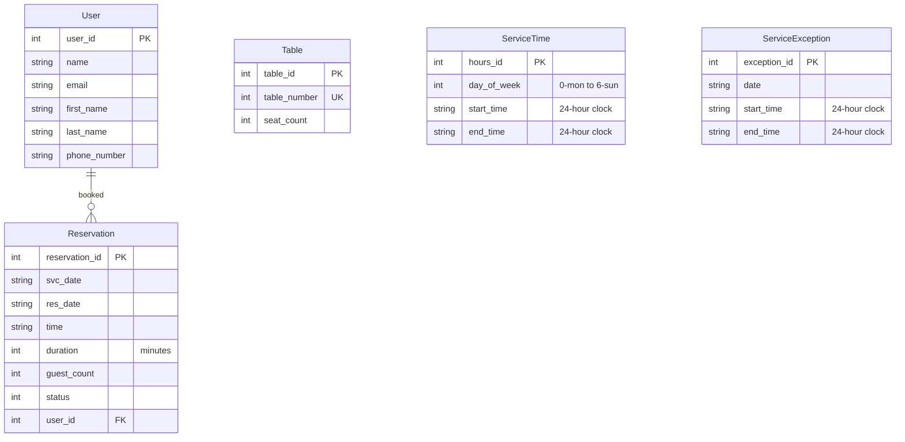
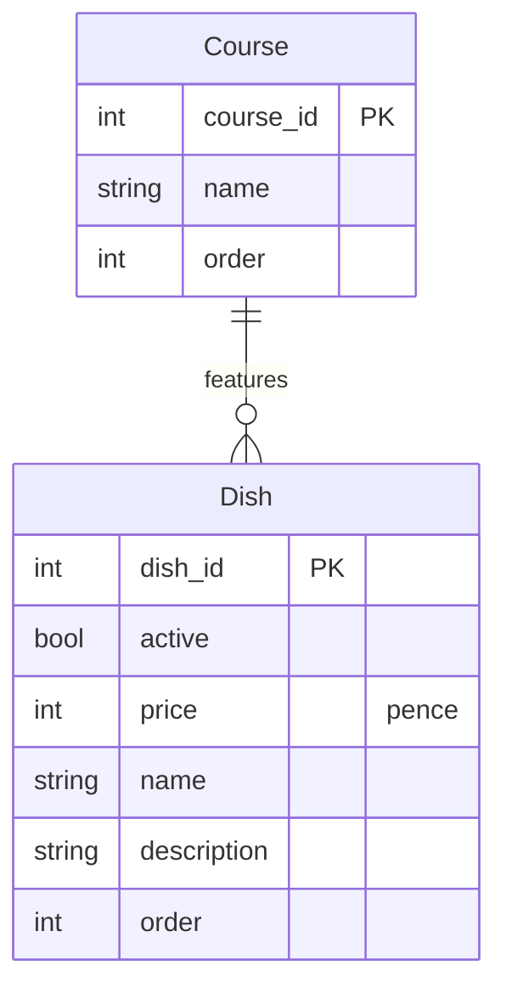

# The Heart of Ruritania

A warm welcome awaits at The Heart of Ruritania, the UK's first Ruritanian restaurant.

[Learn more and book online at our website](https://ruritania-a4a079b504db.herokuapp.com/).

# User Roles and Stories

## Roles

* Browser - a casual user browsing the site without logging in
* User - a registered user
* Colleague - a member of the restaurant's staff
* Admin - the restaurant manager

## Stories

* As a browser I can view the menu so that I can plan my meal
* As a browser I can check opening hours so that I know if the restaurant is available
* As a browser I can find contact details so that I can get my questions answered
* As a browser I can create an account so that I can make a reservation
* As a user I can log in so that I can check my reservations
* As a user I can update my account details so that I can be contacted if needed
* As a user I can make a reservation so that I will be sure to get a table
* As a user I can check my reservations so that to remind myself
* As a user I can delete a reservation so that I don't waste the restaurant's time
* As a user I can leave feedback so that the restaurant will improve
* As a user I can make contact through a form so that I'm saved the bother of calling
* As a user I can leave a review so that other people can learn from my experience
* As an admin I can set opening hours so that users can automatically book
* As an admin I can manage reservations so that I can remove griefers
* As a colleague I can view an overview calendar so that I know how busy we are for the coming week
* As a colleague I can view an overview of the day so that I know how busy we'll be
* As a colleague I can view a service overview so that I can check reservations as diners arrive
* As an admin I can add stories to a news feed so that customers get a sense of continuous improvement
* As an admin I can set the time zone so that so that time-based editing restrictions work correctly

# Data Model

## Reservations

If Reservations are proactively mapped to Tables you can arrive in a situation where there is always a table free but never for long enough to accept a booking, so the restaurant capacity is underutilised.

To achieve an optimal mapping reservations need to be mapped to tables every time the reservations change.  Since it needs to be recalculated repeatedly there is little point in keeping the mapping in the database.

## Menu

The active field on dishes makes it simple to add and remove items from the menu.

## AI

* Menu suggestions.
* Created Django models from entity-relationship diagrams.
* Converted menu contents from markdown to Django `dumpdata` format to get it into the database.
* Identify code in need of comments.
* Hero.

## Testing

Details can be found on the [testing page](TESTING.md).

## Bugs

* Favicon load failure
* Reservations after midnight.

## Credit and Thanks

* [Code Institute](https://codeinstitute.net/) and its tutors for teaching, support and the navbar collapser
* [West Midlands Combined Authority](https://www.wmca.org.uk/) for funding the course
* [Tim Berners-Lee](https://www.w3.org/People/Berners-Lee/) *et al* for the web
* [GitHub](https://github.com/) for hosting the repository and the project plan
* [Heroku](https://www.heroku.com/) for hosting the site
* [Neon](https://neon.com/) for hosting PostgreSQL
* [The Django Authors](https://github.com/django/django/blob/main/AUTHORS) for the web framework
* [Bootstrap](https://getbootstrap.com/) for the CSS framework
* [Font Awesome](https://fontawesome.com/) for icons
* [Fort Awesome](https://github.com/FortAwesome/Font-Awesome/releases) for collating the Font Awesome assets
* [Bunny CDN](https://fonts.bunny.net/) for font hosting
* [Microsoft](https://www.microsoft.com/) for [Visual Studio Code](https://code.visualstudio.com/)
* [Copilot](https://copilot.microsoft.com/) for various tasks as described above
* [W3C](https://www.w3.org/) for the [HTML and CSS validator](https://github.com/validator/validator/)
* [Inkscape](https://inkscape.org/) for rendering the logo and favicons
* [GIMP](https://www.gimp.org/) for cropping many screenshots
* [Coolors](https://coolors.co/) for the palette generator
* [Fireship](https://fireship.dev/amiresponsive) for the multi-device screenshot
* [Multi Device Mockup Generator](https://techsini.com/multi-mockup/) for the multi-device screenshot
* [MeshSVG.com](https://meshsvg.com/textures/#1.eyJ2IjoxLCJtb2RlIjoidGV4dHVyZSIsInNlZWQiOjEyMzQsInBhbGV0dGUiOlsiIzhiNWNmNiIsIiMyMmQzZWUiXSwicGFyYW1zIjp7InJlY2lwZSI6InBhcGVyIiwidGlsZSI6MjU2LCJpbnRlbnNpdHkiOjAuODYsImNvbG9yMSI6IiNlNWRmODciLCJjb2xvcjIiOm51bGwsInRleHR1cmVTZWVkIjoxMjM0fX0) for the background texture
* [Raymond1922A](https://commons.wikimedia.org/wiki/File:Flag_of_Prussia_without_regalia.svg) for the Prussian eagle
